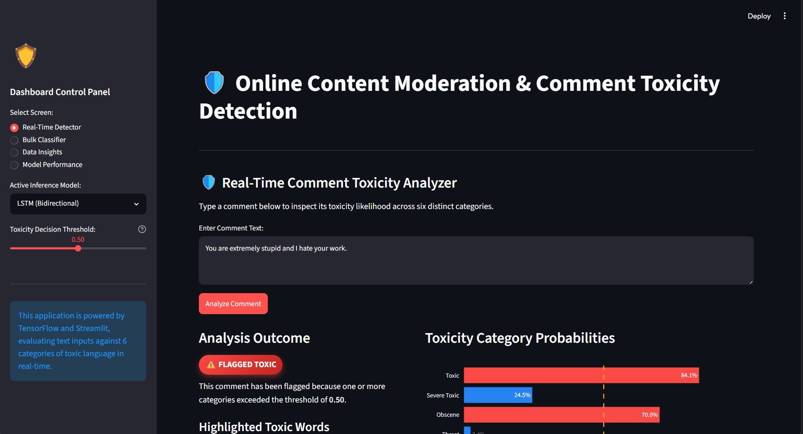
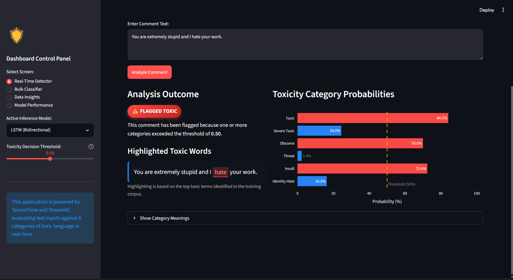
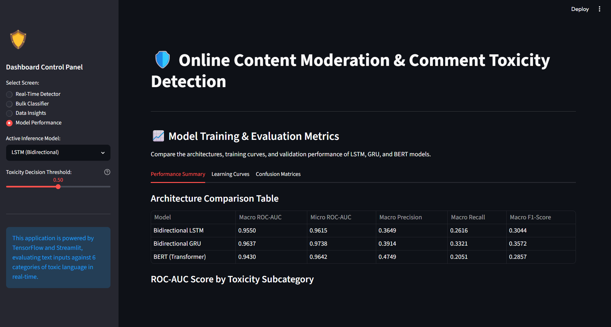
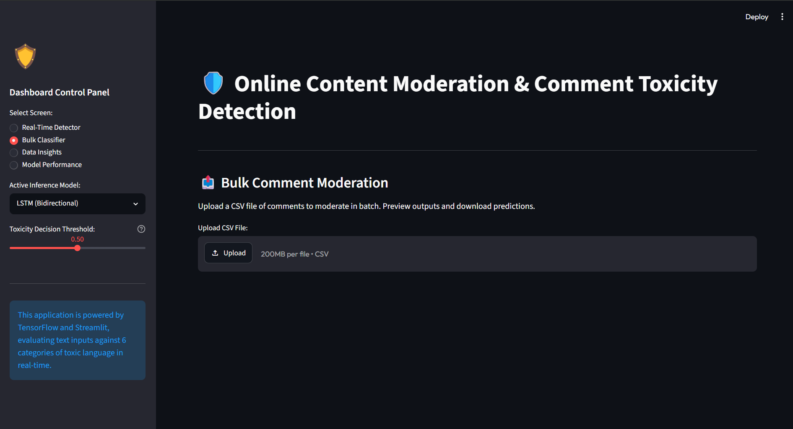
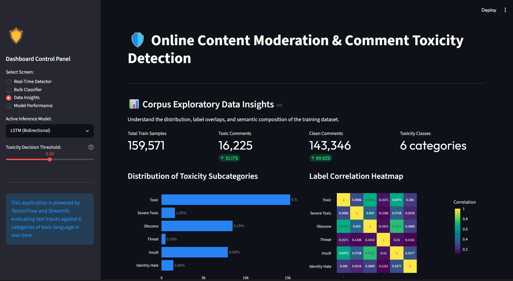
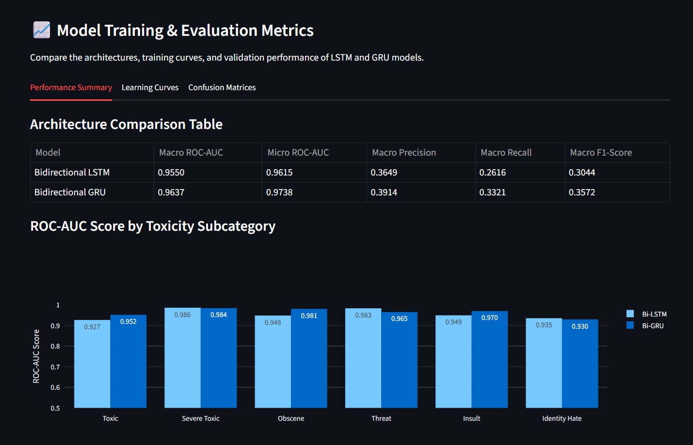

# 🛡️ Comment Toxicity Detection & Moderation Dashboard



An interactive, deep learning-powered web dashboard built with **Streamlit** and **TensorFlow/Keras** for online content moderation. This project implements, evaluates, and compares three neural architectures—**Bidirectional LSTM**, **Bidirectional GRU**, and a **Fine-tuned BERT Transformer**—to detect and classify comments across 6 multi-label toxicity categories.

---

## 🚀 Key Features

* **Multi-Label Toxicity Detection**: Identifies 6 distinct subcategories of toxic comments: *Toxic, Severe Toxic, Obscene, Threat, Insult, and Identity Hate*.
* **Tri-Architecture Evaluation**: Compares recurrent models (**Bi-LSTM**, **Bi-GRU**) with a transformer model (**BERT-Tiny**) on validation accuracy, training speed, ROC-AUC, and F1-scores.
* **Interactive Real-Time Classifier**: Input custom comments, adjust the classification threshold on-the-fly, see model prediction bars, and view highlighted toxic terms automatically.
* **Bulk Upload Moderation**: Upload a CSV file of comments, execute batch predictions, inspect statistics via dynamic pie charts, and download the moderated CSV output.
* **Exploratory Data Insights (EDA)**: Interactive Plotly dashboards displaying class distribution percentages, label correlation heatmaps, word histograms, and top toxic vs. clean vocabularies.
* **Granular Model Diagnostics**: View learning curves (train vs. validation loss/accuracy) and interactively plot confusion matrices for any category and model.
* **Interactive First-Time Setup Wizard**: Run data indexing and model training directly from the UI without terminal commands.

---

## 📊 Model Performance Comparison

Models were trained on a representative sample of **20,000 comments** from the Wiki Toxicity Dataset and evaluated on a **20% validation split (4,000 comments)**:

| Metric | Bidirectional LSTM | Bidirectional GRU | BERT (prajjwal1/bert-tiny) |
| :--- | :---: | :---: | :---: |
| **Macro ROC-AUC** | 0.9550 | 0.9637 | 0.9430 |
| **Micro ROC-AUC** | 0.9615 | 0.9738 | 0.9642 |
| **Macro Precision** | 0.3649 | 0.3914 | 0.4749 |
| **Macro Recall** | 0.2616 | 0.3321 | 0.2051 |
| **Macro F1-Score** | 0.3044 | 0.3572 | 0.2857 |

### Subcategory ROC-AUC Breakdown:

| Category | Bi-LSTM | Bi-GRU | BERT-Tiny |
| :--- | :---: | :---: | :---: |
| **Toxic** | 0.927 | 0.952 | 0.9592 |
| **Severe Toxic** | 0.986 | 0.984 | 0.9899 |
| **Obscene** | 0.948 | 0.981 | 0.9740 |
| **Threat** | 0.983 | 0.965 | 0.8640 |
| **Insult** | 0.949 | 0.970 | 0.9701 |
| **Identity Hate** | 0.935 | 0.930 | 0.9005 |


---

## 🛠️ Project Structure

```
├── Dataset/                     # Project training datasets
│   ├── train.csv                # Wikipedia comment toxicity dataset
│   └── test.csv                 # Testing comments
├── models/                      # Saved checkpoints & cached data
│   ├── bert_model/              # Fine-tuned BERT weights & configuration
│   ├── bi_lstm_model.keras      # Trained Keras Bi-LSTM model
│   ├── bi_gru_model.keras       # Trained Keras Bi-GRU model
│   ├── eda_results.json         # Precomputed data insights cache
│   └── metrics.json             # Model metrics and training curves
├── app.py                       # Main Streamlit web application
├── eda.py                       # Data processing & corpus analytics script
├── train.py                     # Training script (LSTM, GRU, BERT)
├── requirements.txt             # Python packages needed
└── README.md                    # Git repository documentation
```

---

## 💻 Installation & Setup

### Prerequisites
* Python **3.8 - 3.13**
* Virtual environment tool (`venv`)

### 1. Clone & Initialize Environment
```bash
# Clone the repository
git clone https://github.com/your-username/comment-toxicity-detection.git
cd comment-toxicity-detection

# Create a virtual environment
python -m venv .venv

# Activate the virtual environment
# Windows PowerShell:
.\.venv\Scripts\Activate.ps1
# Windows Command Prompt:
.\.venv\Scripts\activate.bat
# Linux/macOS:
source .venv/bin/activate
```

### 2. Install Dependencies
```bash
pip install -r requirements.txt
```

---

## ⚙️ Running Data & Training Pipelines

You can run commands directly from the command line interface (CLI) to prepare data and train the neural networks.

### Step 1: Precompute EDA Insights
To ensure the dashboard loads instantly, run `eda.py` to extract insights and generate word statistics from `Dataset/train.csv`. The results will be exported to `models/eda_results.json`:
```bash
python eda.py
```

### Step 2: Train Deep Learning Models
Use `train.py` to train one or more models. Since training on the full dataset (159,571 comments) can take hours on CPU, the training samples can be scaled using arguments.
```bash
# Train both Bi-LSTM and Bi-GRU with default configurations (20,000 comments, 3 epochs)
python train.py

# Train the BERT model on 10,000 sampled comments for 2 epochs
python train.py --model_type bert --sample_size 10000 --epochs 2

# Train all three architectures (LSTM, GRU, BERT) on 30,000 comments
python train.py --model_type all --sample_size 30000 --epochs 3
```

**Training CLI Arguments:**
* `--sample_size`: Number of samples (e.g. `20000`). Set to `all` or `-1` to use the entire dataset.
* `--epochs`: Training epochs (default: `3`).
* `--batch_size`: Batch training size (default: `64`).
* `--model_type`: Model selection: `lstm`, `gru`, `both`, `bert`, or `all`.

---

## 🖥️ Streamlit User Interface

Launch the Streamlit web dashboard:
```bash
streamlit run app.py
```
The application will host locally and open in your default browser at `http://localhost:8501`.

### 🧭 Dashboard Screen Navigation

1. **Real-Time Detector**:
   
   * Textarea to input any custom statement or block of text.
   * Model selection drop-down to switch inference engines between Bi-LSTM, Bi-GRU, and BERT on the fly.
   * Decision threshold slider (0.10 to 0.90) to adjust confidence scores and toggle flagging metrics.
   * Real-time horizontal bar charts displaying the percentage match for all six toxicity subcategories.
   * Embedded word highlighter that tags and colors high-toxicity vocabulary in the input text.
   
2. **Bulk Classifier**:
   
   * File drop zone for batch moderation uploads (.csv).
   * Drop-down selector to locate text columns.
   * Moderate button to process batch predictions in seconds.
   * Output stats (Total comments, Flagged percentage, Clean approved count).
   * Interactive breakdown pie chart of moderation decisions.
   * Download button to retrieve the fully annotated predictions spreadsheet.
   
3. **Data Insights**:
   
   * Summary metric cards showing total records, toxic percentages, and clean rates.
   * Horizontal bar charts of label counts.
   * Correlation heatmap showcasing overlaps (e.g., how obscenity correlates with insults).
   * Term frequency charts showing top words inside toxic vs. clean comments.
   * Comment word count distribution histogram.
   
4. **Model Performance**:
   
   * Comparative table compiling Macro/Micro AUCs, Precision, Recall, and F1-Scores.
   * Interactive grouped bar charts of AUC breakdowns by category.
   * Interactive training curves showing training vs. validation loss/accuracy history epochs.
   * Interactive confusion matrices showing True Positives, False Positives, True Negatives, and False Negatives for any selected category and model.

---

## 📦 Primary Technology Stack

* **Streamlit**: Web server hosting and interactive frontend widgets.
* **TensorFlow & Keras**: Neural networks construction, serialization, and CPU inference.
* **Transformers (Hugging Face)**: Pre-trained tokenization and BERT modeling (`bert-tiny`).
* **Plotly**: Data visualization, bar charts, heatmaps, and distributions.
* **Scikit-Learn**: Validation splits, precision, recall, confusion matrix calculation, and multi-label metrics.
* **Pandas & NumPy**: Advanced tabular operations and tensor manipulation.
